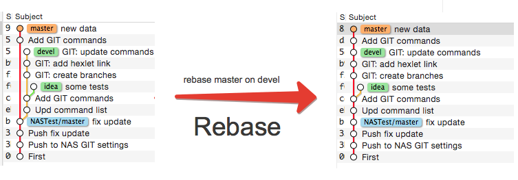
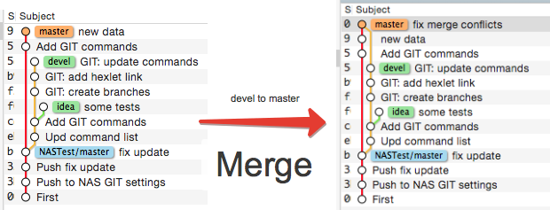
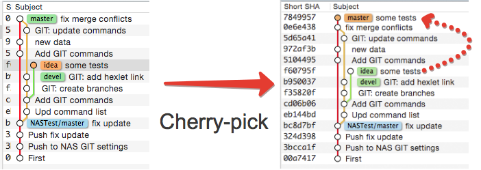

# Git

## Чем отличается REBASE, MERGE, CHERRY-PICK

`git rebase <branch>` - "сшивает" коммиты по дате их создания

`git merge <branch>` - Добавляет коммиты в конец графа

`git chery-pick <branch>` - Забрать коммиты из ветки в свою

